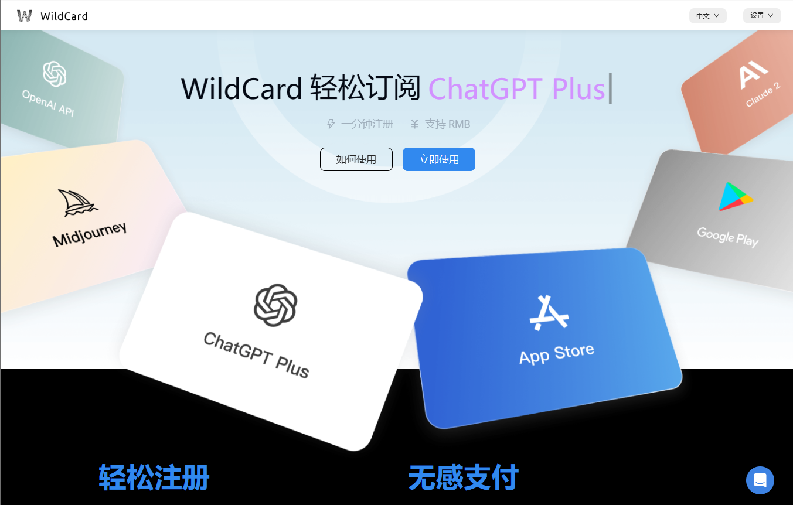

### 通过虚拟信用卡，升级到ChatGPT Plus的步骤

> 由于ChatGPT Plus不支持境内信用卡购买，因而只能“曲线救国”，才能开通Plus会员。

#### 0、常见问题
> 续订ChatGPT Plus失败（您的信用卡被拒绝了。请尝试用借记卡支付。）
>
> To change your billing address, leave this page and restart checkout.
 要更改账单地址，请离开本页并重新开始结账。
>
> We are unable to authenticate your payment method. Please choose a different payment method and try again.
 我们未能验证您的支付方式。请选择另一支付方式并重试。


#### 1、登录OpenAI

> 账号最好为gmail邮箱，如果是微软的邮箱，会导致购买失败，强烈建议直接使用gmail的邮箱注册OpenAI，在进行plus会员购买。第一步依次打开这两个页面就行，后边会用到这里的URL地址。


#### 2、注册WildCard账号

> 试了国内的visa和银联等双币卡，全部支付失败，在国外开卡，目前最好的方式就是开通虚拟卡，实现各种海外的支付。
>
> WildCard注册地址：https://bewildcard.com/i/KK99
>
> OpenAI地址：https://chatgpt.com

##### 2.1 注册账号




```sh
#可以用手机号可以快速注册。
```


##### 2.2 可支付的平台列表


#### 3、申请WildCard虚拟卡

> 在“我的卡片”中，申请信用卡，服务年限可以选择“2年”或者“3年”，然后使用“支付宝”进行支付。


##### 3.1  服务年限选择和支付宝支付

> 建议选择2年的服务年限，默认是11.99美元，使用支付宝进行支付，由于手续费原因，金额会多一点。使用邀请码KK99可以优惠1或2美元。


##### 3.2 填写认证方式

> #认证方式为“支付宝实名认证”和“缴押金免实名认证”，考虑到尽量减少信息泄露，建议选择第二种，支付10美元押金。如果每月支付金额较多，那就选择“支付宝”认证，每月可消费3000美元。


##### 


##### 3.3 实名信息填写

> 填写实名信息,这个建议要用真实信息。


##### 3.4 虚拟银行卡

> 地址信息是自动生成的，一般都是国外的地址。


##### 3.5 修改虚拟银行卡支付密码
> 地址信息是自动生成的，一般都是国外的地址。


#### 4、ChatGPT账号升级

##### 4.1 ChatGPT账号确认

>  不要使用微软的邮箱，最好使用gmail邮箱登陆的chatgpt账号，否则可能会被封号。


##### 4.2 复制升级地址

> 进入chatgpt网站，点击左下角的升级按钮，进入升级页面。


##### 4.3 ChatGPT Plus一键升级


##### 4.4 选择订阅类型，并进行一键升级

> 一般我们选择20美元的plus。
 


##### 


##### 4.5 支付费用

> （1）、提醒进行订阅绑定，每月都会从余额中扣款；
>
> （2）、正常会提醒余额不足，然后转到支付界面进行充值，尽量用多少充多少。


#### 5、体验ChatGPT Plus


